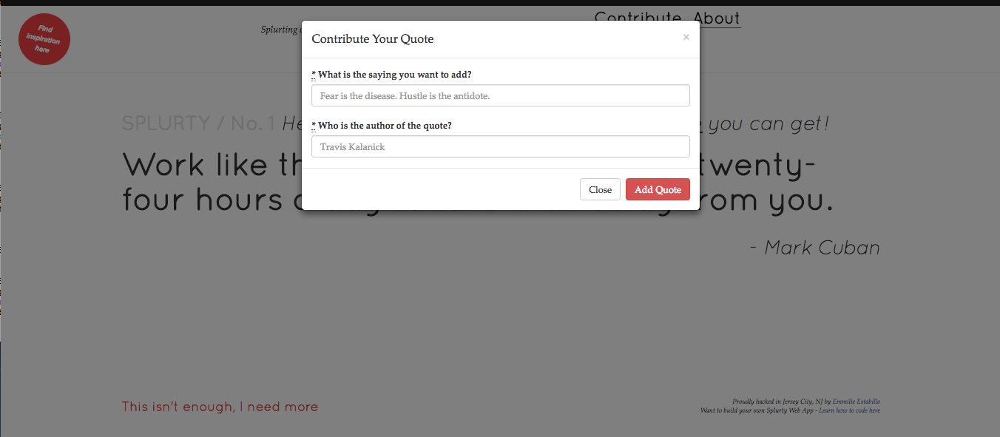

# Splurty

A database-powered quote generator with a mobile-first design, using the Ruby on Rails framework, HTML, and CSS. 

---

## Contributing

1. Fork it ( https://github.com/emestabillo/weatherbee/fork )
2. Create your feature branch (git checkout -b my-new-feature)
3. Commit your changes (git commit -am 'Add some feature')
4. Push to the branch (git push origin my-new-feature)
5. Create a new Pull Request

---

## License and Copyright

Copyright (c) 2016 Em Estabillo
